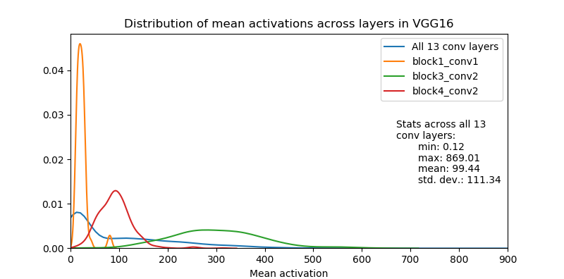

## Normalizing VGG mean activations

This is a Keras implementation of normalization of VGG-like networks so that the mean activation (over images in a dataset and positions in the respective activation map) of convolutional filters in the network is equal to 1. This is mentioned in passing in the [original style transfer paper](https://www.cv-foundation.org/openaccess/content_cvpr_2016/papers/Gatys_Image_Style_Transfer_CVPR_2016_paper.pdf) by Gatys et al:

> We normalized the network by scaling the weights such that the mean 
> activation of each convolutional filter over images and positions is 
> equal to one. Such re-scaling can be done for the VGG network without 
> changing its output, because it contains only rectifying linear 
> activation functions and no normalization or pooling over feature maps.

The benefit of doing it is that losses based on features extracted from different layers of the network (e.g. Gramian based style losses) will have comparable magnitude. In turn, per-layer loss weights will be more interpretable.

Here is a (smoothed) plot of the distribution of mean activations of the VGG16 network across a few convolutional layers before normalization (mean activations calculated over 80000 images of the COCO dataset):




#### How normalization works

First, we gather the mean activations of convolutional filters across all filter activations over all images in the dataset. Then, normalization is done sequentially, from bottom layers to top layers.

Let  and  be the weights and bias of the -th convolutional filter in layer . The shape of the convolution kernel  is  (height, width, incoming channels), but for notational simplicity let's think of it as if it is reshaped to , where .

 is the activation of the -th filter in layer  at the -th position in the activation map. Here  designates the convolution operation (Frobenius inner product)  and  is the patch of  activations in layer  that the filter convolves with.

Let  be the mean activation of the -th filter in layer  over all  images in the dataset  and all  positions in the filter's activation map. Note that this is a non-negative number (and, in fact, positive for the ImageNet pre-trained VGG networks).

Now, the naive approach to normalizing the activations would be to just divide weights and biases by . This would make the mean of the activation equal to 1, **if the previous layer activations were the same as the original non-normalized activations**. That is, , but **only if** the incoming activations  would stay the same as in the original non-normalized network. It is only true for the first convolutional layer in the normalized network. For any other layer this will not only result in wrong scale, but it can actually reverse the sign of the convolution and, consequently, incorrectly zero out or switch on activations after passing through the ReLU.

There is an easy fix, though. We know exactly how we scaled the previous layer, and we can undo it in the current layer. We rescale the subset of weights in  which interact with the -th channel in layer  by multiplying them by . This cancels out the normalization of the previous layer.

More formally, let

 

be the diagonal  matrix of all  mean activations in layer . 

Then, .

The above may look mathy, but it results in only 3 lines of code. For each convolutional layer after the first we do:

```python
# conv layer weights layout is: (dim1, dim2, in_channels, out_channels)
W *= prev_conv_layer_means[np.newaxis, np.newaxis, : , np.newaxis]
b /= means
W /= means[np.newaxis, np.newaxis, np.newaxis, :]
```
Note that the presence of max or average pooling layers doesn't change anything: they simply propagate the scale of the activations from the previous to the next convolutional layer. This means we can simply skip them while normalizing the network.

