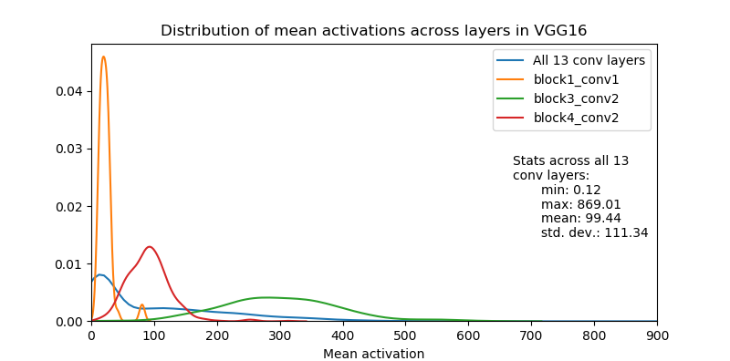

## Normalizing VGG mean activations

This is a Keras implementation of normalization of VGG-like networks so that the mean activation (over images in a dataset and positions in the respective activation map) of convolutional filters in the network is equal to 1. This is mentioned in passing in the [original style transfer paper](https://www.cv-foundation.org/openaccess/content_cvpr_2016/papers/Gatys_Image_Style_Transfer_CVPR_2016_paper.pdf) by Gatys et al:

> We normalized the network by scaling the weights such that the mean 
> activation of each convolutional filter over images and positions is 
> equal to one. Such re-scaling can be done for the VGG network without 
> changing its output, because it contains only rectifying linear 
> activation functions and no normalization or pooling over feature maps.

The benefit of doing it is that losses based on features extracted from different layers of the network (e.g. Gramian based style losses) will have comparable magnitude. In turn, per-layer loss weights will be more interpretable.

Here is a (smoothed) plot of the distribution of mean activations of the VGG16 network across a few convolutional layers before normalization (mean activations calculated over 80000 images of the COCO dataset):




#### How normalization works

First, we gather the mean activations of convolutional filters across all filter activations over all images in the dataset. Then, normalization is done sequentially, from bottom layers to top layers.

Let $W_i^l$ and $b_i^l$ be the weights and bias of the $i$-th convolutional filter in layer $l$. The shape of the convolution kernel $W_i^l$ is $h \times w \times c$ (height, width, incoming channels), but for notational simplicity let's think of it as if it is reshaped to $p \times c$, where $p = h \times w$.

$F_{ij}^l \equiv max(0,\ W_i^l \odot P_j^{l-1}  + b_i^l)$ is the activation of the $i$-th filter in layer $l$ at the $j$-th position in the activation map. Here $\odot$ designates element-wise multiplication and $P_j^{l-1}$ is the patch of $h \times w \times c = p \times c$ activations in layer $l-1$ that the filter convolves with.

Let $\mu_i^l \equiv \mathbb{E}_{X, j}F_{ij}^l = \frac{1}{NM^l} \sum_X \sum_{j=1}^{M^l} F_{ij}^l = \frac{1}{NM^l} \sum_X \sum_{j=1}^{M^l} max(0,\ W_i^l \odot P_j^{l-1}  + b_i^l)$

be the mean activation of the $i$-th filter in layer $l$ over all $N$ images in the dataset $X$ and all $M^l$ positions in the filter's activation map. Note that this is a non-negative number (and, in fact, positive for the ImageNet pre-trained VGG networks).

Now, the naive approach to normalizing the activations would be to just divide weights and biases by $\mu_i^l$. This would make the mean of the activation equal to 1, **if the previous layer activations were the same as the original non-normalized activations**. That is, $\mathbb{E}_{X, j} max(0,\ \frac{W_i^l}{\mu_i^l} \odot P_j^{l-1}  + \frac{b_i^l}{\mu_i^l}) = 1$, but **only if** the incoming activations $P_j^{l-1}$ would stay the same as in the original non-normalized network (which is only true for the first convolutional layer in the normalized network).

There is an easy fix, though. We know exactly how we scaled the previous layer, and we can undo it in the current layer. We rescale the subset of weights in $W_i^l$ which interact with the $k$-th channel in layer ${l-1}$ by multiplying them by $\mu_k^{l-1}$.

More formally, let

$D^{l-1} \equiv \begin{bmatrix} \mu_1^{l-1} & 0 & \dots & 0 \\ 0 & \mu_2^{l-1} & \dots & 0 \\\vdots & & \ddots &  \\ 0 & \dots & 0 & \mu_c^{l-1} \end{bmatrix}$ 

be the diagonal $c \times c$ matrix of all $c$ mean activations in layer $l-1$. 

Then, $\mathbb{E}_{X, j} max(0,\ \frac{W_i^l{D^{l-1}}}{\mu_i^l} \odot P_j^{l-1}  + \frac{b_i^l}{\mu_i^l}) = 1$.

The above may look mathy, but it results in only 3 lines of code. For each convolutional layer after the first we do:

```python
# conv layer weights layout is: (dim1, dim2, in_channels, out_channels)
W *= prev_conv_layer_means[np.newaxis, np.newaxis, : , np.newaxis]
b /= means
W /= means[np.newaxis, np.newaxis, np.newaxis, :]
```
Note that the presence of max or average pooling layers doesn't change anything: they simply propagate the scale of the activations from the previous to the next convolutional layer. This means we can simply skip them while normalizing the network.

